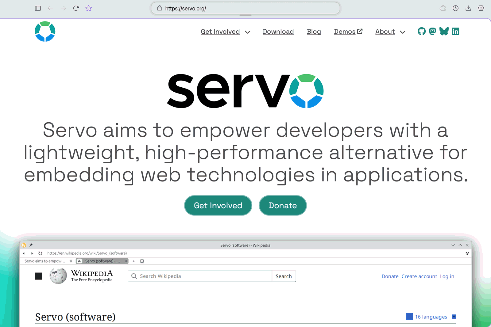

<div align="center">


# Zervo

**A calm, workspace-oriented browser built on the [Servo][servo] engine.**

[](https://github.com/Goddv/Zervo/releases)
[](LICENSE)
[](https://servo.org)


**macOS today — Linux and Windows build from the same tag and are untested.**

<table>
<tr>
<td width="50%" valign="top">

<a href="assets/screenshots/zervo-light.png">
<picture>
  <source media="(prefers-color-scheme: dark)" srcset="assets/screenshots/zervo-dark.png">
  <source media="(prefers-color-scheme: light)" srcset="assets/screenshots/zervo-light.png">
  
</picture>
</a>

</td>
<td width="50%" valign="top">

<a href="assets/screenshots/zervo-light-bar.png">
<picture>
  <source media="(prefers-color-scheme: dark)" srcset="assets/screenshots/zervo-dark-bar.png">
  <source media="(prefers-color-scheme: light)" srcset="assets/screenshots/zervo-light-bar.png">
  
</picture>
</a>

</td>
</tr>
<tr>
<td align="center"><sub><b>Sidebar</b> — navigation, workspaces and tabs in one column<br>
<a href="assets/screenshots/zervo-light.png">light</a> · <a href="assets/screenshots/zervo-dark.png">dark</a>, full size</sub></td>
<td align="center"><sub><b>Collapsed</b> — navigation moves into a bar across the top<br>
<a href="assets/screenshots/zervo-light-bar.png">light</a> · <a href="assets/screenshots/zervo-dark-bar.png">dark</a>, full size</sub></td>
</tr>
</table>

</div>

---

Zervo is a browser chrome — sidebar, workspaces, tabs, settings — wrapped around
Servo, Mozilla's independent web engine written in Rust. There is no Chromium
and no Gecko underneath: the page you are looking at is rendered by Servo.

It is an experiment, and an honest one: Servo is not yet a complete web engine,
so some sites will not work. See [Limitations](#limitations).

## What it looks like

### The window

- **Sidebar-first, or bar-first.** Everything lives in one collapsible sidebar:
  navigation, the address bar, pinned "essentials", workspaces and tabs. Collapse
  it and navigation moves into a bar across the top, with the address pill
  centred on the window and the sidebar left holding only tabs.
- **A bar you arrange.** Drag its buttons between the two sides, take them off,
  put them back. Drag the bar itself taller and it uncovers a shelf of widgets —
  a clock, now playing and transport controls — laid out on a grid, dropped
  where you like and resized by the corner.
- **Workspaces.** Tabs are grouped into named spaces, each with its own colour.
- **Favourites and history.** The star saves a page and hovering it opens the
  list; history is searchable and grouped by how long ago.
- **Saved logins**, kept in the system keychain rather than in Zervo's own files.

### The new tab page

- **Thirteen kinds of card on a twelve-column grid** — clock, world clocks,
  search, pinned tabs, most-visited, recent, favourites, downloads, now playing,
  a note, a to-do list, workspaces, the mark. Press Customise to drag, resize
  and remove them.
- **Eight backdrops**, chosen from the page's own header: Plain, Gradient, Grid,
  Mesh, Aurora, Waves, Particles, or a photograph fetched from Wikimedia Commons
  or Openverse and credited as its licence asks.
- **Text that reads either way.** Cards, the greeting, the clock and the photo
  credit each ask about their own patch of the picture rather than taking one
  answer for the page — a photograph is dark sky at the top and bright water at
  the bottom, and pale text set for the sky disappears into the water.

### How it is put together

- **Every surface is drawn through one material.** Corner radii, fills, sheen,
  shadow reach and how far glass frosts are decided in one place and reach the
  whole application without a call site knowing a number. Surfaces have a class
  — card, menu, input — the way an element has one in CSS.
- **Frosted, over anything.** The chrome sits on real macOS vibrancy, and
  everything floating over a page frosts against a blurred copy of whatever that
  page is showing — so a menu over a website is the same glass as a card over a
  photograph. Two steps, Solid and Frosted, drive the window and everything on
  it together.
- **Themed.** Light/dark/auto following the system, ten accent presets plus a
  colour of your own, and the accent is propagated into the engine so pages see
  the matching `prefers-color-scheme`.

The material system is the seam a theme for another platform would be written
against — Windows, GTK, Android Material, Liquid Glass. It is documented in
[docs/THEMING.md](docs/THEMING.md), including what is not there yet: a theme is
still a Rust constant, and nothing loads one at runtime.

## Building

Zervo builds the Servo engine from source, so the first build is long
(roughly an hour) and needs a lot of disk. Subsequent builds are incremental.

```bash
git clone https://github.com/goddv/zervo
cd zervo
cargo build --profile dev-fast
./target/dev-fast/zervo
```

The toolchain is pinned in `rust-toolchain.toml` and matches Servo's own.
`rustup` will install it automatically; if it complains about unavailable
components, install it explicitly:

```bash
rustup toolchain install 1.97.1 --profile minimal --component clippy,rustfmt
```

### Downloads

File downloads need a small patch to the engine, because Servo has no download
support of its own yet ([servo#40210][downloads-issue]). See
[docs/SERVO.md](docs/SERVO.md) — it is one `git apply` and one Cargo line, and
then:

```bash
cargo build --profile dev-fast --features engine-downloads
```

Without the feature Zervo runs perfectly well; responses the engine cannot
render simply are not offered for saving.

### Packaging

```bash
./scripts/bundle-macos.sh          # -> target/Zervo.app
./scripts/bundle-macos.sh --dmg    # -> target/Zervo.dmg
```

Linux `.deb`/`.rpm` and a Windows `.exe` are built by CI on every release tag —
see [Platforms](#platforms) for how far they have been taken.

macOS builds are unsigned, and macOS will refuse to open one on first launch.
[docs/PACKAGING.md](docs/PACKAGING.md) covers what your users have to do about
that, what signing would cost, and one link-time trap worth knowing about if you
have GStreamer installed.

## Layout

| Path | What lives there |
|------|------------------|
| `src/main.rs` | winit shell, the frame pipeline, input routing, shortcuts |
| `src/app.rs` | engine glue — owns Servo, implements `WebViewDelegate` |
| `src/state.rs` | workspaces, tabs, chrome state |
| `src/ui.rs` | the whole chrome, drawn with egui; emits `UiAction`s |
| `zervo-core/src/theme.rs` | palettes, accents, and the material every surface is built from |
| `zervo-core/src/glass.rs` | the one place a surface is drawn |
| `src/backdrop.rs` | the blurred copy surfaces frost against, and the corner cut |
| `src/newtab.rs` | the new tab page: cards, grid, backdrops |
| `src/wallpaper.rs`, `zervo-core/src/net.rs` | wallpapers from Commons and Openverse |
| `src/widgets.rs` | toggles, sliders, segmented controls |
| `src/icons.rs`, `src/phosphor.rs` | [Phosphor][phosphor] icon rendering |
| `src/downloads.rs` | download manager |
| `src/vibrancy.rs` | macOS `NSVisualEffectView` backdrop |
| `patches/servo/` | engine patches Zervo can build against |

There is a longer tour in [docs/ARCHITECTURE.md](docs/ARCHITECTURE.md),
including how the chrome and the engine share one GL context, and
[docs/THEMING.md](docs/THEMING.md) describes the material system a theme for
another platform would be written against.

## Platforms

Every release tag builds all three. Only one of them has been run.

| Platform | Package | State |
| --- | --- | --- |
| **macOS** (Apple Silicon) | `.dmg`, GStreamer bundled | ✅ Used daily by its author |
| **Debian / Ubuntu** | `.deb` | ⚠️ Builds and installs — never started |
| **Fedora** | `.rpm` | ⚠️ Builds and installs — never started |
| **Windows** x64 | self-contained `.exe` | ⚠️ Builds — startup crash fixed in 0.4.1, unconfirmed |

**Still a macOS release first.** All three packages come from the same tag, and
the material system itself is portable — it is drawn by egui and nothing else.
But the window's frosted backdrop is an AppKit feature, and the corner
compositing built on top of it has been tried nowhere else.

0.4.1 fixes the one thing Windows was known to do: die on startup, before any
window, reading `GL_VERSION` from a context surfman's WGL backend had never
made current. Windows now composites through ANGLE — EGL over Direct3D 11 —
which is what Servo's own Windows builds do. That is a fix made from the crash
log; nobody has watched it start.

Nobody has started Zervo on Linux at all either. The packages compile, package
and install; whether a window opens is untested, and X11 versus Wayland and the
GL setup have never been exercised. **A report that it does not start is as
useful as one that says it does** —
[open an issue](https://github.com/Goddv/Zervo/issues) either way.

Two things macOS keeps that the others do not: the frosted vibrancy behind the
chrome, which is AppKit's, and bundled media — GStreamer is an ordinary package
on Linux and a piece of work not yet done on Windows.

## Limitations

- **Servo is young.** Expect broken layouts, missing APIs, and sites that
  refuse the user agent. This is a property of the engine, not of Zervo.
- **Streaming video does not work.** YouTube and the rest need Media Source
  Extensions, which Servo does not have. Local and progressive video plays.
- **No extensions.** The engine has none, so neither does the button.
- **Passwords cannot be filled into web forms.** The engine offers no hook for
  a submitted form, so saved logins are a vault plus HTTP authentication.
- **No sync, no profiles.** Not yet.
- **Themes are a recompile.** The material seam is real and every surface goes
  through it, but a theme is a Rust constant — no file format, no loader, and
  palettes are not themeable at all yet. See [docs/THEMING.md](docs/THEMING.md).
- **Unsigned builds.** See [docs/PACKAGING.md](docs/PACKAGING.md).

## Contributing

Yes please — see [CONTRIBUTING.md](CONTRIBUTING.md).
[docs/TODO.md](docs/TODO.md) is what is being worked on next;
[docs/PARITY.md](docs/PARITY.md) is the full list of what still stands between
Zervo and a browser you could use daily, in the order the gaps hurt, with where
in the code each one lives. Most of it is embedder work, not engine work.

If you want to improve the *engine*, contribute to [Servo][servo] directly.
Note that Servo does not accept AI-generated contributions.

## Credits

- [Servo][servo] — the engine, MPL-2.0.
- [Phosphor Icons][phosphor] — the icon set, MIT. Vendored in `assets/fonts/`.
- [Zen Browser][zen] — the interaction design Zervo's chrome is modelled on.
  Zervo shares no code with Zen; it is a separate implementation on a
  different engine, and is not affiliated with or endorsed by it.

## License

[MPL-2.0](LICENSE), the same licence as Servo.

[servo]: https://servo.org
[zen]: https://zen-browser.app
[phosphor]: https://phosphoricons.com
[downloads-issue]: https://github.com/servo/servo/issues/40210
