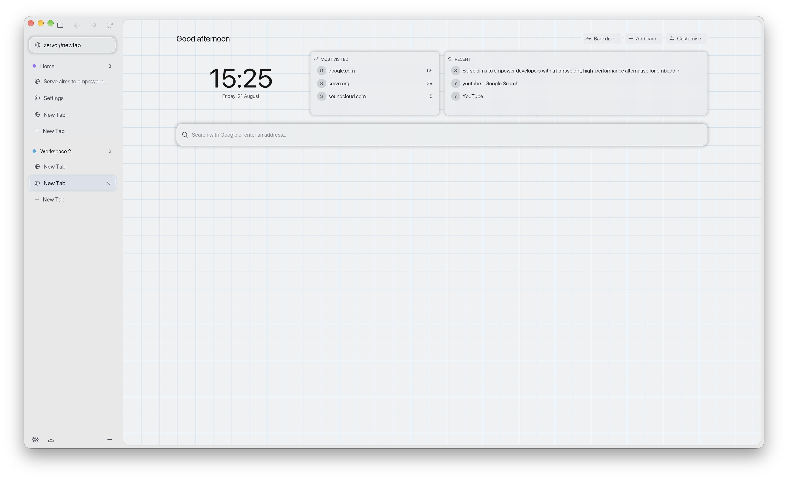

<div align="center">


# Zervo

**A calm, workspace-oriented browser built on the [Servo][servo] engine.**

macOS · Rust · [MPL-2.0](LICENSE)

<picture>
  <source media="(prefers-color-scheme: dark)" srcset="assets/screenshots/zervo-dark.png">
  <source media="(prefers-color-scheme: light)" srcset="assets/screenshots/zervo-light.png">
  
</picture>

</div>

---

Zervo is a browser chrome — sidebar, workspaces, tabs, settings — wrapped around
Servo, Mozilla's independent web engine written in Rust. There is no Chromium
and no Gecko underneath: the page you are looking at is rendered by Servo.

It is an experiment, and an honest one: Servo is not yet a complete web engine,
so some sites will not work. See [Limitations](#limitations).

## What it looks like

- **Sidebar-first, or bar-first.** Everything lives in one collapsible sidebar:
  navigation, the address bar, pinned "essentials", workspaces and tabs. Collapse
  it and navigation moves into a bar across the top, with the address pill
  centred on the window and the sidebar left holding only tabs.
- **A bar you arrange.** Drag its buttons between the two sides, take them off,
  put them back. Drag the bar itself taller and it uncovers a shelf of widgets —
  a clock and media controls so far — laid out on a grid, dropped where you like
  and resized by the corner.
- **Workspaces.** Tabs are grouped into named spaces, each with its own colour.
- **Favourites and history.** The star saves a page and hovering it opens the
  list; history is searchable and grouped by how long ago.
- **Saved logins**, kept in the system keychain rather than in Zervo's own files.
- **Frosted chrome.** Real macOS vibrancy behind an adjustable-opacity chrome.
- **A new tab page you arrange.** Thirteen kinds of card on a twelve-column
  grid — clock, world clocks, search, pinned tabs, most-visited, recent,
  favourites, downloads, now playing, a note, a to-do list, workspaces, the
  mark. Press Customise to drag, resize and remove them. Behind them, either
  one of seven generated backdrops (three animated) or a photograph fetched
  from Wikimedia Commons or Openverse, credited as its licence asks.
- **Themed.** Light/dark/auto following the system, five accent colours that
  retint the whole chrome, and the accent is propagated into the engine so
  pages see the matching `prefers-color-scheme`.

## Building

Zervo builds the Servo engine from source, so the first build is long
(roughly an hour) and needs a lot of disk. Subsequent builds are incremental.

```bash
git clone https://github.com/goddv/zervo
cd zervo
cargo build --profile dev-fast
./target/dev-fast/zervo
```

The toolchain is pinned in `rust-toolchain.toml` and matches Servo's own.
`rustup` will install it automatically; if it complains about unavailable
components, install it explicitly:

```bash
rustup toolchain install 1.97.1 --profile minimal --component clippy,rustfmt
```

### Downloads

File downloads need a small patch to the engine, because Servo has no download
support of its own yet ([servo#40210][downloads-issue]). See
[docs/SERVO.md](docs/SERVO.md) — it is one `git apply` and one Cargo line, and
then:

```bash
cargo build --profile dev-fast --features engine-downloads
```

Without the feature Zervo runs perfectly well; responses the engine cannot
render simply are not offered for saving.

### Packaging a `.app`

```bash
./scripts/bundle-macos.sh          # -> target/Zervo.app
./scripts/bundle-macos.sh --dmg    # -> target/Zervo.dmg
```

The result is unsigned. macOS will refuse to open it on first launch; see
[docs/PACKAGING.md](docs/PACKAGING.md) for what your users have to do about
that, and what signing would cost.

## Layout

| Path | What lives there |
|------|------------------|
| `src/main.rs` | winit shell, the frame pipeline, input routing, shortcuts |
| `src/app.rs` | engine glue — owns Servo, implements `WebViewDelegate` |
| `src/state.rs` | workspaces, tabs, chrome state |
| `src/ui.rs` | the whole chrome, drawn with egui; emits `UiAction`s |
| `src/theme.rs` | palettes, accents, and the material every surface is built from |
| `src/glass.rs` | the one place a surface is drawn |
| `src/backdrop.rs` | the blurred copy surfaces frost against, and the corner cut |
| `src/newtab.rs` | the new tab page: cards, grid, backdrops |
| `src/wallpaper.rs`, `src/net.rs` | wallpapers from Commons and Openverse |
| `src/widgets.rs` | toggles, sliders, segmented controls |
| `src/icons.rs`, `src/phosphor.rs` | [Phosphor][phosphor] icon rendering |
| `src/downloads.rs` | download manager |
| `src/vibrancy.rs` | macOS `NSVisualEffectView` backdrop |
| `patches/servo/` | engine patches Zervo can build against |

There is a longer tour in [docs/ARCHITECTURE.md](docs/ARCHITECTURE.md),
including how the chrome and the engine share one GL context, and
[docs/THEMING.md](docs/THEMING.md) describes the material system a theme for
another platform would be written against.

## Platforms

| Platform | Build | State |
| --- | --- | --- |
| macOS (Apple Silicon) | `.dmg`, GStreamer bundled | Used daily by its author |
| Debian and Ubuntu | `.deb` | Builds and installs; never run |
| Fedora | `.rpm` | Builds and installs; never run |
| Windows x64 | self-contained `.exe` | Builds; never run |

The Linux and Windows packages are new and honest about it: they compile,
package and install, and nobody has started one. Whether Zervo opens a window
there is untested — the rendering context, X11 versus Wayland and the GL setup
have never been exercised. A report either way is genuinely useful.

**0.4.0 is a macOS release first.** All three packages come from the same tag
and the material system is portable — it is drawn by egui and nothing else —
but the window's frosted backdrop is an AppKit feature and the corner work
behind it has been tried nowhere else. Patches for Linux and Windows are 0.4.1.

macOS keeps two things the others do not: the frosted vibrancy behind the chrome,
which is an AppKit feature, and bundled media, since GStreamer on Linux is an
ordinary package and on Windows is a piece of work not yet done.

## Limitations

- **Servo is young.** Expect broken layouts, missing APIs, and sites that
  refuse the user agent. This is a property of the engine, not of Zervo.
- **Streaming video does not work.** YouTube and the rest need Media Source
  Extensions, which Servo does not have. Local and progressive video plays.
- **No extensions.** The engine has none, so neither does the button.
- **Passwords cannot be filled into web forms.** The engine offers no hook for
  a submitted form, so saved logins are a vault plus HTTP authentication.
- **No sync, no profiles.** Not yet.
- **Unsigned builds.** See [docs/PACKAGING.md](docs/PACKAGING.md).

## Contributing

Yes please — see [CONTRIBUTING.md](CONTRIBUTING.md).
[docs/TODO.md](docs/TODO.md) is what is being worked on next;
[docs/PARITY.md](docs/PARITY.md) is the full list of what still stands between
Zervo and a browser you could use daily, in the order the gaps hurt, with where
in the code each one lives. Most of it is embedder work, not engine work.

If you want to improve the *engine*, contribute to [Servo][servo] directly.
Note that Servo does not accept AI-generated contributions.

## Credits

- [Servo][servo] — the engine, MPL-2.0.
- [Phosphor Icons][phosphor] — the icon set, MIT. Vendored in `assets/fonts/`.
- [Zen Browser][zen] — the interaction design Zervo's chrome is modelled on.
  Zervo shares no code with Zen; it is a separate implementation on a
  different engine, and is not affiliated with or endorsed by it.

## License

[MPL-2.0](LICENSE), the same licence as Servo.

[servo]: https://servo.org
[zen]: https://zen-browser.app
[phosphor]: https://phosphoricons.com
[downloads-issue]: https://github.com/servo/servo/issues/40210
