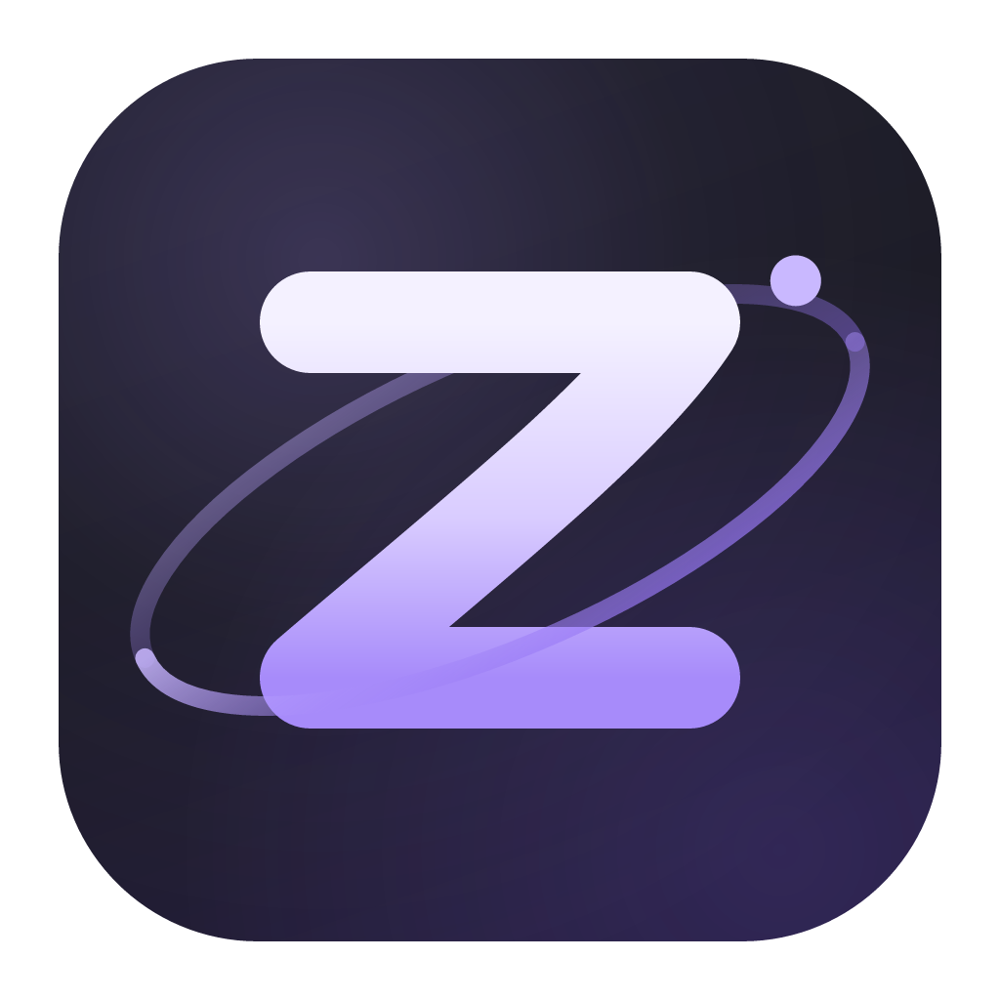

<div align="center">



# Zervo

**A calm, workspace-oriented browser built on the [Servo][servo] engine.**

macOS · Rust · [MPL-2.0](LICENSE)

</div>

---

Zervo is a browser chrome — sidebar, workspaces, tabs, settings — wrapped around
Servo, Mozilla's independent web engine written in Rust. There is no Chromium
and no Gecko underneath: the page you are looking at is rendered by Servo.

It is an experiment, and an honest one: Servo is not yet a complete web engine,
so some sites will not work. See [Limitations](#limitations).

## What it looks like

- **Sidebar-first.** No top toolbar. Navigation, the address bar, pinned
  "essentials", workspaces and tabs all live in one collapsible sidebar.
- **Workspaces.** Tabs are grouped into named spaces, each with its own colour.
- **Frosted chrome.** Real macOS vibrancy behind an adjustable-opacity chrome.
- **A new tab page** with seven backgrounds (three animated) and toggleable
  widgets — clock, greeting, quick links, search.
- **Themed.** Light/dark/auto following the system, five accent colours that
  retint the whole chrome, and the accent is propagated into the engine so
  pages see the matching `prefers-color-scheme`.

## Building

Zervo builds the Servo engine from source, so the first build is long
(roughly an hour) and needs a lot of disk. Subsequent builds are incremental.

```bash
git clone https://github.com/goddv/zervo
cd zervo
cargo build --profile dev-fast
./target/dev-fast/zervo
```

The toolchain is pinned in `rust-toolchain.toml` and matches Servo's own.
`rustup` will install it automatically; if it complains about unavailable
components, install it explicitly:

```bash
rustup toolchain install 1.97.1 --profile minimal --component clippy,rustfmt
```

### Downloads

File downloads need a small patch to the engine, because Servo has no download
support of its own yet ([servo#40210][downloads-issue]). See
[docs/SERVO.md](docs/SERVO.md) — it is one `git apply` and one Cargo line, and
then:

```bash
cargo build --profile dev-fast --features engine-downloads
```

Without the feature Zervo runs perfectly well; responses the engine cannot
render simply are not offered for saving.

### Packaging a `.app`

```bash
./scripts/bundle-macos.sh          # -> target/Zervo.app
./scripts/bundle-macos.sh --dmg    # -> target/Zervo.dmg
```

The result is unsigned. macOS will refuse to open it on first launch; see
[docs/PACKAGING.md](docs/PACKAGING.md) for what your users have to do about
that, and what signing would cost.

## Layout

| Path | What lives there |
|------|------------------|
| `src/main.rs` | winit shell, the frame pipeline, input routing, shortcuts |
| `src/app.rs` | engine glue — owns Servo, implements `WebViewDelegate` |
| `src/state.rs` | workspaces, tabs, chrome state |
| `src/ui.rs` | the whole chrome, drawn with egui; emits `UiAction`s |
| `src/theme.rs` | palettes, accents, light/dark resolution |
| `src/glass.rs` | the translucent material |
| `src/widgets.rs` | toggles, sliders, segmented controls |
| `src/icons.rs`, `src/phosphor.rs` | [Phosphor][phosphor] icon rendering |
| `src/downloads.rs` | download manager |
| `src/vibrancy.rs` | macOS `NSVisualEffectView` backdrop |
| `patches/servo/` | engine patches Zervo can build against |

There is a longer tour in [docs/ARCHITECTURE.md](docs/ARCHITECTURE.md),
including how the chrome and the engine share one GL context.

## Limitations

- **macOS only.** The vibrancy, Dock icon and bundling are AppKit-specific.
  The rest is portable, and patches for other platforms are welcome.
- **Servo is young.** Expect broken layouts, missing APIs, and sites that
  refuse the user agent. This is a property of the engine, not of Zervo.
- **No extensions, no sync, no profiles.** Not yet.
- **Unsigned builds.** See [docs/PACKAGING.md](docs/PACKAGING.md).

## Contributing

Yes please — see [CONTRIBUTING.md](CONTRIBUTING.md). Good first areas: session
restore, tab drag-reordering, dialogs (`alert`/`confirm`/`prompt`), IME, and
Linux/Windows support.

If you want to improve the *engine*, contribute to [Servo][servo] directly.
Note that Servo does not accept AI-generated contributions.

## Credits

- [Servo][servo] — the engine, MPL-2.0.
- [Phosphor Icons][phosphor] — the icon set, MIT. Vendored in `assets/fonts/`.
- [Zen Browser][zen] — the interaction design Zervo's chrome is modelled on.
  Zervo shares no code with Zen; it is a separate implementation on a
  different engine, and is not affiliated with or endorsed by it.

## License

[MPL-2.0](LICENSE), the same licence as Servo.

[servo]: https://servo.org
[zen]: https://zen-browser.app
[phosphor]: https://phosphoricons.com
[downloads-issue]: https://github.com/servo/servo/issues/40210
